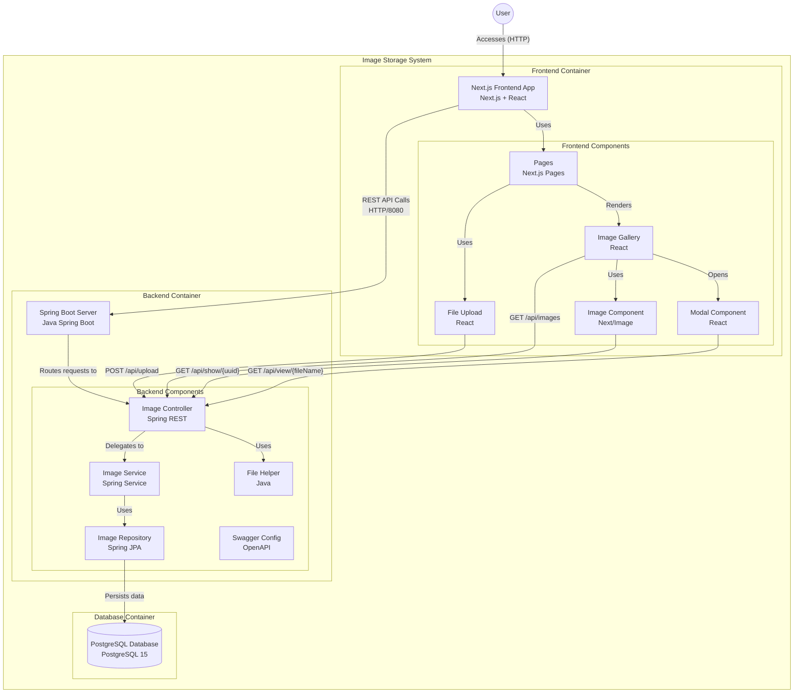

```mermaid
graph TB
    User((User))

    subgraph "Image Storage System"
        subgraph "Frontend Container"
            NextApp["Next.js Frontend App<br>Next.js + React"]
            
            subgraph "Frontend Components"
                Pages["Pages<br>Next.js Pages"]
                ImageGallery["Image Gallery<br>React"]
                Modal["Modal Component<br>React"]
                FileUpload["File Upload<br>React"]
                ImageComponent["Image Component<br>Next/Image"]
            end
        end
        
        subgraph "Backend Container"
            SpringApp["Spring Boot Server<br>Java Spring Boot"]
            
            subgraph "Backend Components"
                ImageController["Image Controller<br>Spring REST"]
                ImageService["Image Service<br>Spring Service"]
                ImageRepository["Image Repository<br>Spring JPA"]
                FileHelper["File Helper<br>Java"]
                SwaggerConfig["Swagger Config<br>OpenAPI"]
            end
        end
        
        subgraph "Database Container"
            PostgresDB[("PostgreSQL Database<br>PostgreSQL 15")]
        end
    end

    %% Frontend relationships
    User -->|"Accesses (HTTP)"| NextApp
    NextApp -->|"Uses"| Pages
    Pages -->|"Renders"| ImageGallery
    ImageGallery -->|"Opens"| Modal
    Pages -->|"Uses"| FileUpload
    ImageGallery -->|"Uses"| ImageComponent

    %% Backend relationships
    NextApp -->|"REST API Calls<br>HTTP/8080"| SpringApp
    SpringApp -->|"Routes requests to"| ImageController
    ImageController -->|"Delegates to"| ImageService
    ImageService -->|"Uses"| ImageRepository
    ImageController -->|"Uses"| FileHelper
    ImageRepository -->|"Persists data"| PostgresDB

    %% Cross-container data flow
    FileUpload -->|"POST /api/upload"| ImageController
    ImageGallery -->|"GET /api/images"| ImageController
    ImageComponent -->|"GET /api/show/{uuid}"| ImageController
    Modal -->|"GET /api/view/{fileName}"| ImageController
```
